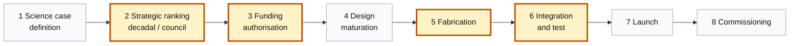
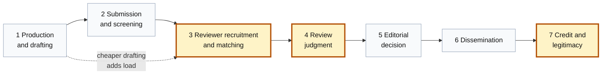
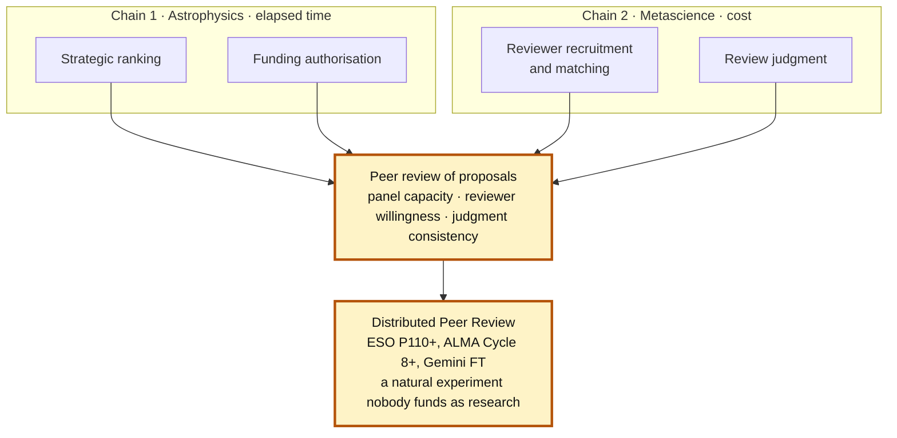

# Two worked critical paths

Generated from `critical_paths` and `critical_path_links`. Method:
`methodology/critical-path.md`. Both expectations were committed in `bbfa54f`,
before any link analysis existed; the links and findings arrived in the next
commit. The ordering is checkable in git rather than asserted.

Two chains, chosen so the results differ. A single chain shows the method works;
a pair shows it discriminates. Doing this across the whole map is the
collaboration being proposed, not the thing being given away.

---

## Chain 1 — Frontier Telescopes Are Expensive and Take Decades to Build

**Gap:** `1c1cb37e-2a00-8008-9ca1-cf81d4b44116` (Astrophysics)
**Axis:** elapsed time from first concept study to first light
**Axes excluded:** cost per unit of collecting area; cost per unit of science
return. Their sentence bundles cost with schedule, and the two run over a partly
different set of links.

Shaded links bind. Their three capabilities for this gap — modular assembly with
reduced launch costs, a space telescope factory, and leveraging commercial
component advances — all act on links 5 to 7.

### What the chain reveals

Four links bind, and no current AI capability touches any of them. Which pair
dominates depends on the programme, which was not predicted:

| Programme | Concept → construction start | Construction → first light | Total |
|---|---:|---:|---:|
| JWST | 1989 → 2004, 15 y | 2004 → 2021, 17 y | 32 y |
| Rubin | early 1990s → Aug 2014, ~22 y | Aug 2014 → Jun 2025, 10.9 y | ~33 y |
| ELT | 1998 → Dec 2014, 16 y | Dec 2014 → Mar 2029, 14.3 y | ~31 y |

JWST is build-dominated; Rubin is decision-dominated; the ELT sits between them
with roughly two and a half years attributable to nothing but a funding condition
on an already-approved design.

Closing every cognitive link leaves a frontier telescope taking more than twenty
years. The generous accounting, treating the whole seven-year science-case period
as compressible, removes about nine and a half of JWST's thirty-two years. The
realistic accounting, which notes those years went to community consensus rather
than to analysis, removes about two and a half.

### Links

| # | Link | Blocker | AI type | Maturity | Binding |
|---|---|---|---|---|:-:|
| 1 | Science case definition | Community consensus, not analysis capacity | LLM reasoning and synthesis | Working now | |
| 2 | Strategic ranking | Fixed decadal cadence; miss it and wait ten years | Coordination and institutional | Speculative | ● |
| 3 | Funding authorisation | Appropriation and conditions attached to it | Coordination and institutional | Speculative | ● |
| 4 | Design maturation | Technology readiness for long-lead items | Design and optimization search | Working now | |
| 5 | Fabrication | Long-lead optics, cryogenic qualification | Physical build and manipulation | 2-5 years | ● |
| 6 | Integration and test | Serial single-string assembly, nothing parallelises | Physical build and manipulation | Speculative | ● |
| 7 | Launch | Vehicle availability and window | Physical build and manipulation | Working now | |
| 8 | Commissioning | On-orbit alignment of a segmented optic | Sensing and signal processing | Working now | |

Link 8 is the chain in miniature: wavefront sensing across eighteen segments is
the most demanding cognitive task in the sequence and it took under seven months.

---

## Chain 2 — Doing and publishing research is expensive and subject to structural roadblocks

**Gap:** `1c1cb37e-2a00-8063-9b9f-f3c2aa784e50` (Metascience)
**Axis:** cost, measured as reviewer and editor labour per published paper
**Axes excluded:** speed and inclusiveness. Speed in particular behaves
differently by venue — journal latency is reviewer-supply-driven, conference
latency is set by a fixed programme committee calendar — so a chain mixing them
would produce a binding link that is an artifact of the venue mix.

The dotted edge is the result that was not predicted: relieving link 1 adds load
to link 3.

### What the chain reveals

AI is not absent here. It acts fully on links 1 and 2 and on half of link 3 —
more than it touches anywhere in chain 1. The finding is that those are the links
that were never rate-limiting.

Link 3 splits into two problems that are usually named as one. **Matching** is a
well-posed prediction problem; on reviewer identification specifically, traditional
statistical representations outperform generative AI. **Willingness** is a
labour-supply problem that no matching system addresses. The binding half is the
half AI does not touch.

This chain does **not** show that publishing is a cognitive bottleneck. It shows
the reverse: the cognitive links are the cheap ones.

One observation about their capability set, running the other way from chain 1:
two of the four capabilities they attach to this gap — a post-publication peer
review layer, and new protocols for knowledge production and verification — act
directly on link 7, which binds.

### Links

| # | Link | Blocker | AI type | Maturity | Binding |
|---|---|---|---|---|:-:|
| 1 | Production and drafting | Author time; cost already collapsed | LLM reasoning and synthesis | Working now | |
| 2 | Submission and desk screening | Editor triage time | LLM reasoning and synthesis | Working now | |
| 3 | Reviewer recruitment and matching | Willingness to serve, not ability to identify | ML surrogates and prediction | 2-5 years | ● |
| 4 | Review judgment | Irreducible subjectivity above the bar | LLM reasoning and synthesis | 2-5 years | ● |
| 5 | Editorial decision | Editor labour and accountability | Coordination and institutional | 2-5 years | |
| 6 | Dissemination | Article processing charges, platform cost | Coordination and institutional | Working now | |
| 7 | Credit and legitimacy | Committees decide what counts | Coordination and institutional | Speculative | ● |

Evidence for link 3: roughly five invitations per accepted review (Silverchair,
*Future of Peer Review* 2026); 55% of 139 surveyed editors rate finding reviewers
a significant challenge, some sending 30 or more invitations to secure two
(Jamali, Luca and Wakeling, 15 February 2026); 21 years of declining reviewer
acceptance (Meyerson, 2002–2024).

Evidence for link 4: the NeurIPS 2021 consistency experiment found two independent
committees disagreeing on 23% of papers with roughly half the accept list changing
on a rerun, consistent with 26% in 2014; and Cortes and Lawrence find review scores
predict later impact for rejected papers but not for accepted ones.

---

## The intersection

This is the most valuable structural finding in the project, and neither chain
produces it alone.

**Chain 1's links 2 and 3 are an instance of chain 2's links 3 and 4.** Facility
approval and telescope time are both allocated by peer review of proposals. The
decadal survey is a review panel. An observing-time allocation committee is a
review panel. The blocker on chain 1's ranking link — a fixed cadence and a
scarce panel — is chain 2's reviewer recruitment link seen from the facility side.

The evidence for this is not an analogy. It is ESO's own stated reason for
changing the mechanism. Introducing **Distributed Peer Review**, in which every PI
submitting a qualifying proposal reviews ten others, ESO writes that panel load
"has become unsustainable", that classical triage "has significantly degraded the
quality of feedback for the triaged proposals", and that "it has become
progressively harder to find scientists willing to serve in the panels and in the
OPC". Those are chain 2's link 3 and link 2 verbatim, written by an observatory
about telescope time. DPR has run at ESO since Period 110 and was deployed at ALMA
from Cycle 8 and in Gemini's Fast Turnaround channel before that.

That is a live natural experiment in review capacity under load, at scale, with a
before and after — and, as far as this search found, nobody funds it as research.

Two gaps, in two different fields of their map, sharing a binding link. A
catalogue cannot show this: it has one row per gap and no place to record that
two rows are blocked by the same thing. Chains can, and once you have chains the
recurrence is countable rather than anecdotal. That is the argument for doing this
across the whole map, and it is the reason there are exactly two chains here.
